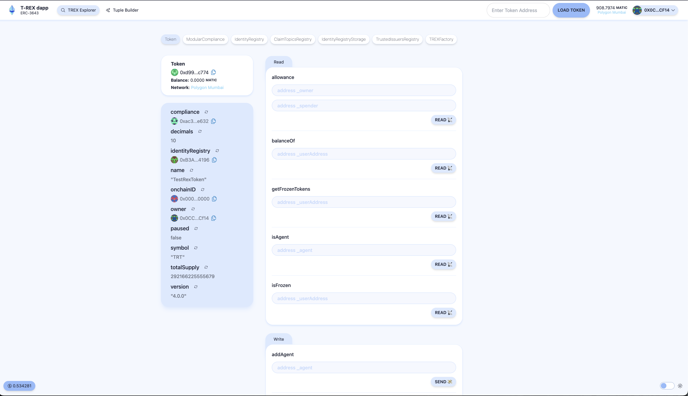

# 🏗 ERC-3643-DApp

<h4 align="center">
  <a href="https://www.erc3643.org/">Official Website</a>
</h4>

🧪 The ERC-3643-DApp is an open-source project initiated by the ERC-3643 association. It aims to promote the use of the ERC-3643 standard for tokenized assets by providing a robust and scalable decentralized application.

⚙️ Built using NextJS, RainbowKit, Foundry/Hardhat, Wagmi, Viem, and Typescript.

- ✅ **Token Loading**: Easily load any ERC-3643 compliant token by pasting its address.
- 🔐 **Integration with Wallet Providers**: Connect to different wallet providers and interact with the Ethereum network.



## Requirements

Before you begin, you need to install the following tools:

- [Node (>= v18.18)](https://nodejs.org/en/download/)
- Yarn ([v1](https://classic.yarnpkg.com/en/docs/install/) or [v2+](https://yarnpkg.com/getting-started/install))
- [Git](https://git-scm.com/downloads)
- [ts-node](https://www.npmjs.com/package/ts-node) (For running the server)

## Quickstart

To get started with ERC-3643-DApp, follow the steps below:

1. Install the latest version of Scaffold-ETH 2

```
npx create-eth@latest
```

This command will install all the necessary packages and dependencies, so it might take a while.

> [!NOTE]
> You can also initialize your project with one of our extensions to add specific features or starter-kits. Learn more in our [extensions documentation](https://docs.scaffoldeth.io/extensions/).

2. Run a local network in the first terminal:

```
ts-node server.ts
```

This command starts a local Ethereum network that runs on your local machine and can be used for testing and development. Learn how to [customize your network configuration](https://docs.scaffoldeth.io/quick-start/environment#1-initialize-a-local-blockchain).

3. On a second terminal, deploy the test contract:

```
yarn deploy
```

This command deploys a test smart contract to the local network. You can find more information about how to customize your contract and deployment script in our [documentation](https://docs.scaffoldeth.io/quick-start/environment#2-deploy-your-smart-contract).

4. On a third terminal, start your NextJS app:

```
yarn start
```

Visit your app on: `http://localhost:3000`. You can interact with your smart contract using the `Debug Contracts` page. You can tweak the app config in `packages/nextjs/scaffold.config.ts`.

**What's next**:

Visit the [What's next section of our docs](https://docs.scaffoldeth.io/quick-start/environment#whats-next) to learn how to:

- Edit your smart contracts
- Edit your deployment scripts
- Customize your frontend
- Edit the app config
- Writing and running tests
- [Setting up external services and API keys](https://docs.scaffoldeth.io/deploying/deploy-smart-contracts#configuration-of-third-party-services-for-production-grade-apps)

## Documentation

Visit our [docs](https://docs.scaffoldeth.io) to learn all the technical details and guides of Scaffold-ETH 2.

## Contributing to ERC-3643-DApp

We welcome contributions to the ERC-3643-DApp!

Please see [CONTRIBUTING.MD](https://github.com/ERC-3643/ERC-3643-DApp/blob/main/CONTRIBUTING.md) for more information and guidelines for contributing to ERC-3643-DApp.

---
